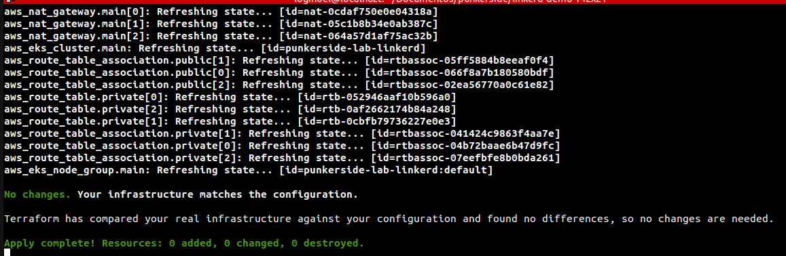
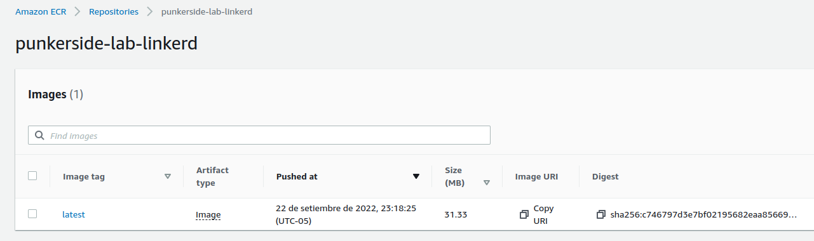
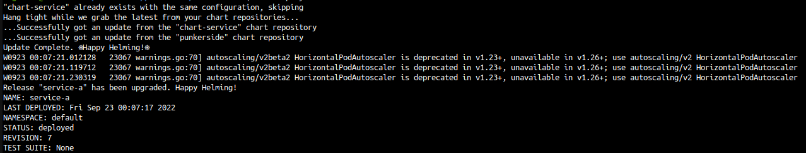
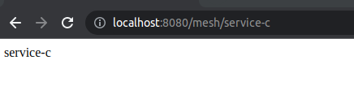

# Service Mesh for Kubernetes - Linkerd

[](https://github.com/punkerside/linkerd/tags/)

<p align="center">
  
</p>

## **Prerrequisitos**

* [Instalar Docker](https://docs.docker.com/engine/install/)
* [Instalar Kubectl](https://kubernetes.io/docs/tasks/tools/install-kubectl-linux/)
* [Instalar Helm](https://helm.sh/docs/intro/install/)
* [Instalar Linkerd](https://linkerd.io/2.11/getting-started/)

## **Uso**

1. Desplegar cluster k8s:

```console
make cluster
```

<p align="center">
  
</p>

2. Liberando imagen de prueba en AWS ECR:

```console
make release
```

<p align="center">
  
</p>

3. Desplegando aplicacion de prueba en AWS EKS:

```console
make deploy
```

<p align="center">
  
</p>

Para validar el servicio desplegado:

```console
kubectl port-forward svc/service-a 8080:80
```

```console
curl http://localhost:8080/status
curl http://localhost:8080/mesh/service-c
```

<p align="center">
  
</p>

4. Instalando Linkerd:

```console
make linkerd
```

<p align="center">
  
</p>

5. Activando Dashboard:

```console
make linkerd-viz
```

6. Agregando malla de servicio a la aplicacion de prueba:

```console
make inject
```

<p align="center">
  
</p>

* Para validar la malla de servicio:

```console
kubectl port-forward svc/service-a 8080:80
```

* Para monitorear el funcionamiento de la malla:

```console
# in
linkerd viz tap deploy/service-a
```

```console
# out
linkerd viz tap deploy/service-b
```

<p align="center">
  
</p>

* Para generar trafico en la malla:

```console
curl http://localhost:8080/mesh/service-a
curl http://localhost:8080/mesh/service-b
curl http://localhost:8080/mesh/service-c
```

7. Eliminando todos los recursos:

```console
make destroy
```