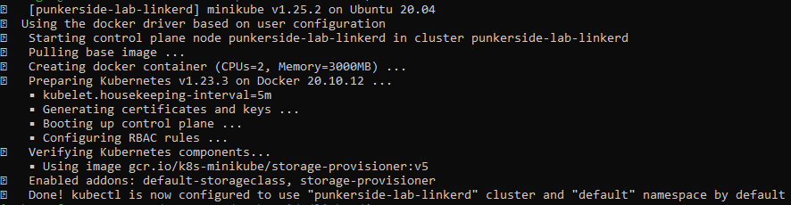
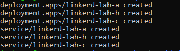
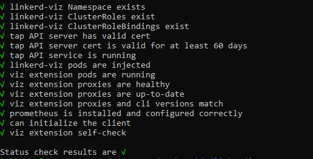
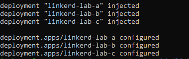
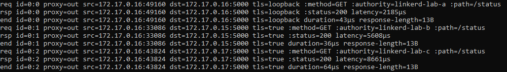

## **Prerrequisitos**

### Binarios instalador:

* [Instalar Docker](https://docs.docker.com/engine/install/)
* [Instalar Minikube](https://minikube.sigs.k8s.io/docs/start/)
* [Instalar Kubectl](https://kubernetes.io/docs/tasks/tools/install-kubectl-linux/)
* [Instalar Linkerd](https://linkerd.io/2.11/getting-started/)

### Cuentas creadas:

* [Usuario DockerHub](https://hub.docker.com/signup)


## **Variables**

| Name | Description | Type | Default | Required |
|------|-------------|------|---------|----------|
| `DOCKER_USER` | Usuario dockerhub | string | | yes |
| `DOCKER_PASS` | Contraseña dockerhub | string | | yes |

## **Uso**

1. Iniciando cluster de Kubernetes:

```console
make minikube
```

<p align="center">
  
</p>

2. Liberando nueva version de la aplicacion de prueba:

```console
make release DOCKER_USER=myUsers DOCKER_PASS=myPassword
```

3. Desplegando aplicacion de prueba:

```console
make deploy DOCKER_USER=myUsers
```

<p align="center">
  
</p>

Para validar el servicio desplegado:

```console
kubectl port-forward svc/linkerd-lab-a 8080:80
```

```console
curl http://localhost:8080/status
curl http://localhost:8080/mesh/linkerd-lab-b
```

4. Instalando Linkerd:

```console
make linkerd
```

<p align="center">
  
</p>

5. Agregando aplicacion de prueba a la malla de servicio:

```console
make mesh
```

<p align="center">
  
</p>

* Para exponer servicio en local:

```console
kubectl port-forward svc/linkerd-lab-a 8080:80
```

<p align="center">
  
</p>

* Para monitorear el funcionamiento de la malla:

```console
linkerd viz tap deploy/linkerd-lab-a
```

<p align="center">
  
</p>

* Para generar trafico en la malla:

```console
curl http://localhost:8080/mesh/linkerd-lab-a
curl http://localhost:8080/mesh/linkerd-lab-b
curl http://localhost:8080/mesh/linkerd-lab-c
```

6. Para eliminar todos los servicios desplegados:

```console
make delete
```